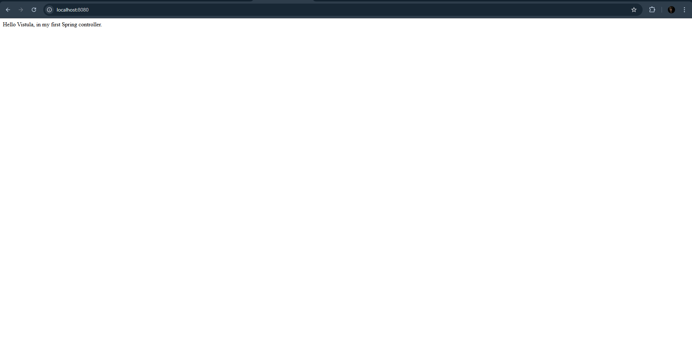

# Task 1: First Project Java Spring

Hi! This is my project for **Task 1**. It is a simple web application built with Java and Spring Boot that demonstrates how to use Controllers and Thymeleaf templates.

## Technologies Used
* **Java 21**
* **Spring Boot**
* **Thymeleaf** 
* **Maven**

## How to Run the Application
1.  Open the project in your IDE .
2.  Run the application using the Maven wrapper command:
    ```bash
    ./mvnw spring-boot:run
    ```
3.  The server will start at `http://localhost:8080`.

## Use Cases 

Here are the endpoints I implemented according to the instructions:

### 1. Root Page
* **URL:** `http://localhost:8080/`
* **Description:** Displays a simple text message from the controller.
* **Result:**
  

### 2. Greeting Page
* **URL:** `http://localhost:8080/greeting`
* **Description:** Displays a greeting page with a default name.
* **Result:**
  

### 3. Greeting Page (Custom)
* **URL:** `http://localhost:8080/greeting?name=Student`
* **Description:** Displays the greeting page customized with the name provided.
* **Result:**
  